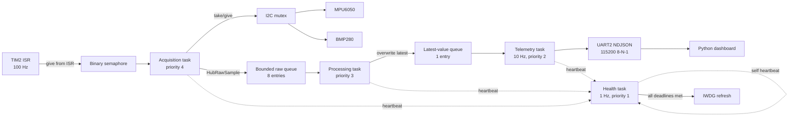

# FreeRTOS Sensor Hub

[](https://github.com/RohitPatel97/freertos-sensor-hub/actions/workflows/ci.yml)

A fault-aware, four-task sensor acquisition application for an
**STM32F401RE**, **MPU6050**, and **BMP280**. The embedded adapter demonstrates
100 Hz interrupt-driven sampling, bounded FreeRTOS queues, mutex-protected I2C,
retry and disconnect handling, task-health-gated watchdog service, ARM DWT
timing, and 10 Hz UART telemetry. A deterministic C simulator and a
dependency-free Python reference generator make the design reviewable without
the board.

> **Validation boundary:** the portable C core, deterministic host model, and
> Python tooling are designed for automated host validation. The STM32 HAL /
> FreeRTOS adapter is an integration-ready reference, but this repository does
> **not** claim a physical board build, timing capture, electrical test, or
> long-duration hardware run. The bring-up gates below make that remaining work
> explicit.

## What this repository proves

The problem is maintaining useful data and diagnostics when a sensor disappears,
a consumer falls behind, or a task stops running. The solution separates device
drivers, acquisition, processing, telemetry, and watchdog decisions so each
failure has an observable outcome. The implementation demonstrates embedded C,
STM32/FreeRTOS adapter design, I2C/UART interfaces, interrupt handoff, bounded
queues, mutexes, fault injection, C unit tests, Python integration tests, CMake,
and GitHub Actions CI.

| Capability | Implementation evidence | Automated evidence | Status |
|---|---|---|---|
| 100 Hz acquisition trigger | TIM2 ISR gives a binary semaphore with `xSemaphoreGiveFromISR` | simulator models binary-semaphore coalescing and counts tick overruns | Host verified; target integration pending |
| Four-task FreeRTOS design | acquisition, processing, telemetry, and health tasks in `app_freertos.c` | health model tests per-task deadlines | Implemented; target compile pending |
| Serialized, recoverable I2C | one mutex surrounds each complete transaction; up to two retries | unit test asserts lock/retry/unlock accounting; fault simulator injects NACKs | Host verified |
| MPU6050 + BMP280 acquisition | device-ID checks, setup registers, burst reads, Bosch integer compensation | BMP280 datasheet compensation vector; simulated register devices | Host verified |
| Backpressure visibility | bounded raw queue and overwrite-latest telemetry queue | slow-consumer scenario asserts queue drops | Host verified |
| Disconnect/recovery | shared host/target state machine; offline after three failed acquisitions | either/both sensors, startup absence, and brief dropout scenarios | Host verified |
| Timing instrumentation | DWT CYCCNT around acquisition and processing | deterministic synthetic timing fields on host | Target measurement pending |
| Watchdog/task health | per-task heartbeat deadlines; refresh only when all four are alive | stalled acquisition also expires processing health once input stops | Host verified |
| 10 Hz telemetry + dashboard | versioned NDJSON over UART, file replay, and stdin | parser/renderer tests and compiled-simulator outage/recovery replays | Host verified; UART pending |

## Architecture

Latest local verification (October 1, 2026): **5 C test groups**, **12 simulator
scenarios**, **2 simulator-to-dashboard recovery replays**, **69 CLI rejection
cases**, and **22 Python tool tests** passed. A fresh CMake/Ninja Release build
used Zig 0.16.0 / Clang 21.1.0 with strict warnings and Python 3.12.14. See
[validation evidence](docs/VALIDATION.md) and [project workflow](WORKFLOW.md).



The ISR never performs I2C or formatting. It only signals work and requests a
context switch when appropriate. A binary semaphore intentionally coalesces
late ticks instead of creating an unbounded backlog; every coalesced tick is
reported as `sample_tick_overruns`.

## Task model and invariants

| Task | Period / trigger | Responsibility | Health deadline |
|---|---|---|---:|
| Acquisition | TIM2 semaphore, 10 ms | Read both sensors, update online state and I2C counters, enqueue raw sample | 30 ms |
| Processing | raw queue | Scale IMU data, compensate barometer data, calculate altitude, publish latest sample | 100 ms |
| Telemetry | 100 ms | Snapshot counters, encode one bounded NDJSON frame, transmit UART | 250 ms |
| Health | 1 s | Check all heartbeats; feed or intentionally withhold IWDG | 1500 ms |

Key invariants:

- Every I2C operation acquires the same mutex once, holds it across all retry
  attempts, and releases it on success or terminal failure.
- Queue operations never block acquisition. A full raw queue increments a drop
  counter; processed telemetry uses overwrite-latest semantics so consumers see
  the freshest state.
- A sensor becomes offline only after three consecutive failed acquisition
  cycles, preventing a single transient NACK from flapping status.
- Sensor failure does not imply task failure. The watchdog stays eligible while
  tasks are scheduling and reporting the degraded sensor state.
- A missing task heartbeat withholds refresh; the independent hardware watchdog
  is then expected to reset the MCU.
- On target, DWT measurements are unsigned cycle deltas, so one counter wrap is
  safe for these short measured regions.

## Quick start: deterministic host path

The C host path needs CMake 3.16+ and a C99 compiler. Install Python 3.10+ before
configuring to include simulator integration and Python tooling tests in CTest.
It uses the same drivers,
compensation, processing, health, retry, and telemetry modules as the target
adapter.

```bash
cmake -S . -B build -DCMAKE_BUILD_TYPE=Release
cmake --build build --config Release --parallel
ctest --test-dir build -C Release --output-on-failure
./build/sensor_hub_sim --duration-ms 3000
```

On multi-config Windows generators, the executable is commonly
`build/Release/sensor_hub_sim.exe`.

No C toolchain is required to exercise the protocol and dashboard:

```bash
python tools/reference_sim.py --duration-ms 3000 > capture.ndjson
python tools/dashboard.py --file capture.ndjson --no-ansi
python -m unittest discover -s tests -p "test_*.py" -v
```

The reference generator is deliberately labeled as a tooling model. It does not
replace execution of the C simulator in CI.

### Watch a sensor fail and recover

Pipe the compiled simulator directly into the dashboard; `--file -` reads
standard input, so no capture file or serial hardware is needed:

```bash
./build/sensor_hub_sim --duration-ms 2000 --disconnect mpu --disconnect-at-ms 500 --reconnect-at-ms 1000 | python tools/dashboard.py --file - --no-ansi
```

Expect 20 snapshots: acceleration and gyro readings become `n/a` during the
outage, the MPU6050 status becomes `OFFLINE` after three failed acquisitions,
and readings resume after reconnection. The barometer continues reporting.
Use `--disconnect all` to exercise simultaneous sensor loss. The simulator's
JSON summary is written to stderr, separately from telemetry on stdout.

## Fault injection

All host faults are deterministic and reproducible:

```bash
# A transient NACK every seventh physical bus attempt; retries should recover.
./build/sensor_hub_sim --duration-ms 3000 --i2c-nack-every 7

# Permanently remove the barometer at 500 ms.
./build/sensor_hub_sim --duration-ms 2000 --disconnect bmp --disconnect-at-ms 500

# Restore the barometer at 1000 ms and verify valid data returns.
./build/sensor_hub_sim --duration-ms 2000 --disconnect bmp --disconnect-at-ms 500 --reconnect-at-ms 1000

# Force raw-queue pressure by consuming at 33 Hz instead of 100 Hz.
./build/sensor_hub_sim --duration-ms 1000 --queue-capacity 2 --processor-period-ms 30

# Stop the processing task; the 1 Hz health check withholds watchdog refresh.
./build/sensor_hub_sim --duration-ms 3000 --stall-task processing --stall-at-ms 1200
```

| Scenario | Injected behavior | Expected observable |
|---|---|---|
| Nominal | none | 100 acquired/processed samples per second, 10 frames/s, zero errors/drops |
| Transient bus fault | every Nth physical I2C attempt NACKs | `i2c_retries` rises; terminal `i2c_errors` may remain zero |
| Sensor unplug | MPU6050, BMP280, or both stop acknowledging | three failed cycles, sensor becomes `offline`, telemetry continues |
| Slow consumer | processing period exceeds 10 ms | bounded raw queue fills and `queue_drops` rises |
| Acquisition stall | semaphore is no longer consumed | `tick_overruns` rises and health later fails |
| Task stall | selected task stops heartbeating | `deadline_misses` and `watchdog_withheld` rise |

The C simulator writes telemetry to stdout and one JSON summary to stderr.
The summary includes `sensor_disconnects` and `sensor_reconnects`; the existing
version-1 UART format is unchanged. `--reconnect-at-ms` restores simulated
register responses and exercises the portable driver's reinitialization path.
It does not model electrical startup or conversion-ready timing. Omit it for
the original permanent-outage behavior. This option belongs to the C simulator;
the Python reference generator is a separate tooling model.

Numeric options accept decimal digits only, up to `4294967295`. Duration is
further limited to **1..3600000 ms** (one simulated hour), queue capacity to 1..16,
and processor period must be positive. Reconnect requires a selected disconnect
target and a later timestamp. Invalid input exits 2 before simulation. These
checks prevent truncation and a `UINT32_MAX` duration loop wrapping indefinitely.

## Problem / solution test cases

| Problem to reproduce | Implemented solution | Automated acceptance evidence |
|---|---|---|
| Scheduling must keep up with acquisition | Bounded queues and separate processing/reporting periods | 2 s produces 200 processed samples, 20 frames, zero drops, and two watchdog feeds |
| Removing a sensor must not stop the other sensor | Independent valid bits and retrying drivers | BMP outage yields `baro: null`, MPU stays online, and terminal I2C errors rise |
| A restored sensor must resume valid data | Drivers reinitialize; shared status logic counts transitions | MPU, BMP, and both-device outages at 500 ms recover at 1000 ms with one disconnect/reconnect per device |
| Sensors may be absent at boot | Read path retries initialization | Both sensors absent at 0 ms regain payloads after 500 ms; two reconnects, no previous online-to-offline transition |
| Brief faults must not cause status flapping | Three consecutive failed acquisitions required for offline status | A one-cycle fault increases I2C errors without a disconnect/reconnect |
| Long outages must not overflow error state | Saturating failure count in shared host/target status logic | 303 failures leave count at 255 and one disconnect; recovery clears the count |
| Slow consumers must not create unlimited backlog | Fixed queue capacity and observable drops | Capacity 2 and a 30 ms processing period produce drops |
| Task failure must stop watchdog service | Per-task heartbeat deadlines | Processing stall withholds service; acquisition stall also increases tick overruns |
| A task waiting for input must not look productive | Processing heartbeat follows a successful dequeue, matching the target adapter | Acquisition stall at 1200 ms produces four deadline misses across the 2 s and 3 s health checks; boot stall leaves both tasks unhealthy |
| A valid missing-sensor frame must not stop monitoring | Render null payloads as `n/a`, independently of debounced sensor state | Two compiled-simulator recovery replays render every snapshot through MPU-only and simultaneous outages |
| Corrupted captures must not terminate a session | Validate each line and skip malformed frames with a diagnostic | Invalid UTF-8, oversized numbers, invalid schema types, and decoder-limit failures are rejected; following valid frames survive |
| A millisecond clock can wrap | Unsigned elapsed-time comparison | Across `UINT32_MAX`, 30 ms passes and 31 ms misses the acquisition deadline |
| Invalid sensor data must not cause arithmetic errors | Validate raw ADC values and guard compensation arithmetic | Negative/sentinel/out-of-range raw data, zero pressure calibration, and overflowing corrupt trim are rejected without modifying output |
| Invalid CLI inputs must fail promptly | Strict decimal/range checks and bounded duration | 69 malformed or out-of-range inputs exit 2 without telemetry |

Tests are in [`tests/c/test_core.c`](tests/c/test_core.c),
[`tests/test_sim_cli.py`](tests/test_sim_cli.py), and the Python `tests/test_*.py`
modules: **5 C test groups, 12 compiled simulator scenarios, 2 dashboard recovery
replays, 69 CLI rejection cases, and 22 Python tests**. With Python available,
CTest runs all three suites. Run the quick-start commands above. See
[`docs/VALIDATION.md`](docs/VALIDATION.md) for execution evidence and
[`WORKFLOW.md`](WORKFLOW.md) for follow-up work.

## Telemetry protocol

UART emits one UTF-8 JSON object per line at 10 Hz. Protocol version 1 keeps the
wire format self-identifying and makes captures easy to inspect with standard
tools. A nominal frame looks like:

```json
{"schema":1,"type":"telemetry","seq":9,"ts_us":100000,"sensors":{"mpu6050":"online","bmp280":"online"},"imu":{"accel_g":[-0.1389,0.1,0.9889],"gyro_dps":[-2.084,1.389,-0.695],"temperature_c":24.73},"baro":{"temperature_c":25.08,"pressure_pa":100652.0,"altitude_m":56.18},"health":{"i2c_retries":0,"i2c_errors":0,"queue_drops":0,"deadline_misses":0,"watchdog":"withheld"},"timing":{"acquisition_us":91,"processing_us":33}}
```

`watchdog: "withheld"` during the first second is expected: all four tasks must
establish a heartbeat before the first eligible refresh. Missing sensor payloads
are encoded as `null`; counters are monotonic until reset. See
[`docs/PROTOCOL.md`](docs/PROTOCOL.md) for field semantics and forward-compatible
parser rules.

## Live dashboard

Install the only optional runtime dependency and connect to the Nucleo virtual
COM port:

```bash
python -m pip install -r requirements.txt
python tools/dashboard.py --port COM5 --baud 115200
# Linux example: --port /dev/ttyACM0
```

Use `--demo` for an endless simulated feed, `--file` to replay a capture,
`--file -` to read piped NDJSON,
`--no-ansi` for logs/CI, and `--max-frames N` for bounded runs. Malformed lines
are reported to stderr and skipped. Missing IMU or barometer payloads display
`n/a`, including the debounce interval when sensor status still says `ONLINE`.
File and stdin replay isolate invalid UTF-8 to its affected line. Integer
fields must fit the firmware's unsigned widths; sensor numbers must be finite.
Unknown additive fields remain available through the parser's raw mapping.

## Hardware and wiring

| NUCLEO-F401RE | MPU6050 / BMP280 | Notes |
|---|---|---|
| 3V3 | VCC | Use 3.3 V-compatible breakout boards |
| GND | GND | Common ground |
| PB8 / D15 | SCL | I2C1 SCL, 4.7 kOhm pull-up to 3.3 V |
| PB9 / D14 | SDA | I2C1 SDA, 4.7 kOhm pull-up to 3.3 V |
| PA2 / ST-LINK VCP TX | host RX | USART2 telemetry at 115200 baud |

The defaults assume MPU6050 address `0x68` (AD0 low) and BMP280 address `0x76`
(SDO low). Both modules must be true I2C variants; some inexpensive boards label
BMP180 or BME280 parts incorrectly.

For CubeMX settings, source-copy steps, and staged hardware checks, see
[`target/stm32f401re/README.md`](target/stm32f401re/README.md).

## Build and flash the STM32 target

1. Generate a NUCLEO-F401RE project in STM32CubeIDE with I2C1, USART2, TIM2,
   IWDG, and FreeRTOS configured as documented in the target README.
2. Copy `target/stm32f401re/Core/{Inc,Src}` into the generated project.
3. Add `include/` and all portable `src/*.c` files to the target build. Enable
   hardware floating-point (`-mfpu=fpv4-sp-d16 -mfloat-abi=hard`), link
   `libm` because altitude uses `powf`, and enable float formatting in
   newlib-nano (typically linker option `-u _printf_float`).
4. Call `HubRtos_Init()` after `MX_*_Init()` and forward the TIM2 callback.
5. Build and flash with STM32CubeIDE or its generated Makefile, then inspect the
   115200-baud virtual COM port.

Do not enable the IWDG until the UART and health states are understood; once an
IWDG starts on STM32 it cannot be stopped without reset.

## Design decisions

- **Integer BMP280 compensation:** follows the datasheet algorithm and is tested
  against its published calibration/raw vector. Floating point is used only in
  the lower-priority processing stage for human-readable units and altitude.
- **Retry inside one mutex hold:** prevents another task from interleaving a
  transaction between attempts and keeps error accounting at the operation
  boundary. The 5 ms HAL timeout bounds each attempt.
- **Latest-value telemetry:** UART reporting should not force acquisition to
  replay stale data. A one-slot overwrite queue makes the policy explicit.
- **NDJSON instead of a binary protocol:** at 10 Hz and 115200 baud, readability
  and easy capture outweigh bandwidth. The formatter uses a fixed buffer and
  rejects truncation.
- **Blocking UART in the adapter:** bounded 10 Hz transmission keeps the example
  easy to integrate. DMA with a dedicated TX queue is the next step if UART
  latency is significant in measured target timing.
- **Host simulation over mocked RTOS threads:** deterministic millisecond event
  scheduling makes fault regressions exact and fast. It models scheduling
  contracts, not FreeRTOS kernel internals.

## Repository layout

```text
.
├── .github/workflows/ci.yml       # Ubuntu C/Python validation
├── include/sensor_hub/            # Portable public interfaces
├── src/                           # Drivers, retry layer, health, processing, JSON
├── sim/host_sim.c                 # Deterministic executable register/RTOS model
├── target/stm32f401re/            # STM32 HAL + FreeRTOS integration adapter
├── tools/                         # Parser, dashboard, reference generator
├── tests/c/                       # Portable C unit tests
├── tests/test_python_tools.py     # Python protocol/dashboard tests
├── tests/test_dashboard.py        # Outage rendering and file/stdin replay
├── tests/test_telemetry_parser.py # Schema, numeric bounds, and malformed input
├── tests/test_sim_cli.py          # Compiled-simulator black-box scenarios
├── docs/                          # Protocol and validation details
└── CMakeLists.txt
```

## Known limitations and next validation steps

- The checked-in target folder is not a complete generated `.ioc` project;
  CubeMX-generated startup, linker script, HAL, and FreeRTOS sources remain
  board/tool-version specific.
- No physical sensor identity, bus waveform, UART capture, DWT timing
  distribution, watchdog reset, stack high-water mark, or soak result is claimed.
- The BMP280 is configured for an approximately 9.2 ms normal-mode cadence and
  read at 100 Hz. Because conversion and acquisition are asynchronous, a value
  can occasionally repeat; use forced mode or status/data-ready synchronization
  if strict one-conversion-per-record behavior is required.
- `timestamp_us` in the adapter derives from a 1 kHz RTOS tick, while DWT fields
  provide sub-millisecond duration. A free-running 64-bit hardware timebase would
  improve timestamp resolution.
- Production deployments should add static task allocation, DMA UART,
  application-specific calibration, sensor self-tests, brownout logging, and
  stack/heap telemetry after measuring the actual workload.

The physical validation checklist is tracked in
[`docs/VALIDATION.md`](docs/VALIDATION.md). Contributions are welcome under the
guidelines in [`CONTRIBUTING.md`](CONTRIBUTING.md).

## License

MIT — see [`LICENSE`](LICENSE).
